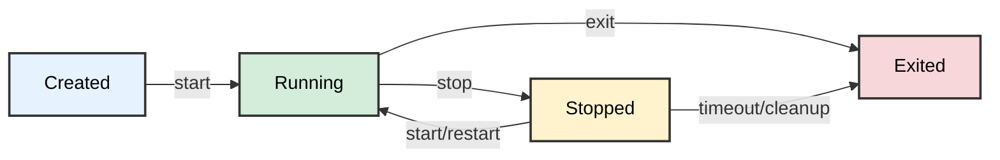

# RustBox

> A Docker-like container runtime written in Rust with daemon architecture, supporting multi-container orchestration, persistent state management, container networking, and comprehensive CLI commands.

## Overview

**RustBox** is a container runtime that isn't competing with Docker or Kubernetes. We return to the core and build a simplest "Sandbox/isolated runtime environment" from the lowest level Linux kernel mechanisms (namespaces, cgroups, OverlayFS, etc.), provides Docker-like functionality using:

- **Daemon Architecture** with Unix domain socket communication
- **Multi-container Management** with persistent state
- **Container Restart Support** with preserved filesystem state
- **Container Networking** with bridge, veth pairs, NAT, and port forwarding
- **OverlayFS** for isolated container filesystems  
- **Cgroups v2** for resource limits (memory, CPU, PIDs, swap)
- **Linux namespaces** for complete process isolation
- **Environment Variables** passed into containers at runtime
- **Comprehensive CLI** with run, start, stop, list, inspect, remove, logs, and attach commands

This tool is designed for container orchestration, testing environments, and secure code execution.

## Requirements

- Linux kernel 5.x or higher (with overlayfs and cgroups v2 support)
- Rust (1.70+ recommended) 
- Root privileges (for daemon operations, mounting, and namespace creation)

## Architecture

### Daemon-Client Model


```
┌──────────────────────────────────────────────────────────────────────────────┐
│                                RustBox Architecture                          │
└──────────────────────────────────────────────────────────────────────────────┘

[rustbox CLI]                                 [rustboxd Daemon]
     │                                               │
     │  Unix Socket                                  │
     │  /tmp/rustbox-daemon.sock                     │
     │                                               │
     │  IPC Protocol (JSON messages)                 │
     │  ───────────────────────────────────────────▶ │
     │  Commands:                                   │
     │   • run                                      │
     │   • stop                                     │
     │   • list                                     │
     │   • inspect                                  │
     │   • remove                                   │
     │   • logs                                     │
     │   • attach                                   │
     │                                               ▼
     │                                    ┌────────────────────────────┐
     │                                    │  Container Manager         │
     │                                    │  ───────────────────────── │
     │                                    │  • Controls lifecycle      │
     │                                    │  • Creates sandbox env     │
     │                                    │  • Manages PTY + process   │
     │                                    └────────────────────────────┘
     │                                               │
     │                                               ▼
     │                                    ┌────────────────────────────┐
     │                                    │  Registry (HashMap<ID, Container>)│
     │                                    └────────────────────────────┘
     │                                               │
     │                     ┌────────────────────────────────────────────┐
     │                     │           Container Instances              │
     │                     └────────────────────────────────────────────┘
     │                         │              │              │
     │                         ▼              ▼              ▼
     │                    [Container 1]  [Container 2]  [Container N]
     │                         │              │              │
     │                  ┌──────────────────────────────────────────────┐
     │                  │              Sandbox Components               │
     │                  │  overlayfs + cgroups + namespaces             │
     │                  └──────────────────────────────────────────────┘
     │                         │
     │                         │
     │  (When attaching)       │
     │  ───────────────────────────────────────────────────────────────────────────
    ┌─────────────────────────────────────────────────────────────────────────────┐
    │                            Container Attach Flow                            │
    └─────────────────────────────────────────────────────────────────────────────┘

    Client (e.g. docker attach, CLI, web terminal)
    │
    │  1. Send/receive stdin/stdout over Unix socket
    ▼
    ┌───────────────────────────────────────────────────────────┐
    │ Daemon Process                                            │
    │ ───────────────────────────────────────────────────────── │
    │  • Manages container lifecycle                            │
    │  • Holds PTY master side                                  │
    │  • Forwards data between client and container             │
    │                                                           │
    │  ┌──────────────────────────────────────────────────────┐ │
    │  │ Unix Socket (Client ↔ Daemon)                        │ │
    │  │  - AttachStdin  (client → daemon)                    │ │
    │  │  - AttachStdout (daemon → client)                    │ │
    │  └──────────────────────────────────────────────────────┘ │
    │                              │
    │                              │ (I/O forwarding loop) 
    │                              ▼
    │  ┌──────────────────────────────────────────────────────┐ │
    │  │ PTY Master                                           │ │
    │  │  - Pseudo terminal device endpoint controlled by     │ │
    │  │    the daemon                                        │ │
    │  │  - Reads container output                            │ │
    │  │  - Writes client input                               │ │
    │  └──────────────────────────────────────────────────────┘ │
    │                              │
    │                              │ (kernel-level link)
    │                              ▼
    │  ┌──────────────────────────────────────────────────────┐ │
    │  │ PTY Slave                                            │ │
    │  │  - Exposed inside the container as /dev/tty or stdin │ │
    │  │  - Attached to the container’s process (e.g. /bin/bash)││
    │  │  - Container writes stdout/stderr → goes to Master   │ │
    │  │  - Container reads stdin ← comes from Master         │ │
    │  └──────────────────────────────────────────────────────┘ │
    └───────────────────────────────────────────────────────────┘
    │
    ▼
    Container Process (e.g. /bin/bash, sh)
    • Reads from stdin (/dev/tty)
    • Writes to stdout/stderr (/dev/tty)

    ───────────────────────────────────────────────────────────────
    Summary:
    - PTY Master: controlled by the daemon, mediates all I/O
    - PTY Slave : presented to the container process as its terminal
    - Unix Socket: transports attach stream between client ↔ daemon
    ───────────────────────────────────────────────────────────────

```
### Container Isolation

RustBox employs a **double fork** pattern for each container to ensure proper isolation:

### Process Hierarchy (Per Container)

```
[Daemon Process]
    └─> spawn_blocking()
        └─> [Container Task]
            └─> fork() #1
                ├─> [Namespaced Parent Process]
                │   ├─> unshare() - Creates new namespaces
                │   ├─> setup cgroups and overlay
                │   └─> fork() #2
                │       ├─> [Inner Child Process]
                │       │   ├─> Mount /proc and /dev
                │       │   ├─> chroot() to merged overlay
                │       │   ├─> chdir() to working directory
                │       │   └─> execv() - Execute command
                │       └─> [Namespaced Parent] waits for inner child
                │           └─> Unmounts /proc and /dev inside namespace
                └─> [Container Task] waits for namespaced parent
                    ├─> Unmounts overlay filesystem
                    ├─> Cleans up cgroups
                    └─> Updates container state in registry
```

### Container Lifecycle States



> Containers in the `Stopped` state can be restarted with the `start` command, preserving their filesystem state. Containers that have naturally exited (state `Exited`) cannot be restarted.

### Persistent State Management

- **Container metadata**: `/var/lib/rustbox/containers/<container-id>.json` (includes network config, exit code, etc.)
- **Container logs**: `/var/lib/rustbox/logs/<container-id>/`
- **Overlay filesystems**: `/var/lib/rustbox/overlay/<container-id>/` (upperdir persists across restarts)
- **Network state**: `/tmp/rustbox/network/ip_counter`
- **State recovery**: Daemon recovers container state on restart

## Installation

### Build from Source

```bash
git clone https://github.com/isdaniel/RustBox.git
cd RustBox

# Initialize and update submodules (required for rootfs)
git submodule update --init --recursive

cargo build --release
```

**Alternative - Clone with submodules in one step:**
```bash
git clone --recurse-submodules https://github.com/isdaniel/RustBox.git
cd RustBox
cargo build --release
```

> This project uses git submodules to manage the container rootfs. The `rootfs/lowerdir` directory is a submodule pointing to a separate repository.

#### Initial Setup

If you've already cloned the repository without submodules:

```bash
# Initialize and clone the submodule
git submodule update --init --recursive
```

### Binaries

After building, you'll have two binaries:
- `rustbox` - Client CLI tool
- `daemon_rs` - Background daemon process

## Usage

### Start the Daemon

```bash
# Start the daemon in background (requires root)
sudo ./target/release/daemon_rs 2>&1 &
```

The daemon will:
- Listen on Unix socket `/tmp/rustbox-daemon.sock`
- Create system directories under `/var/lib/rustbox/`
- Recover existing container state from disk
- Handle graceful shutdown on SIGTERM/SIGINT

### Container Management

#### Create and Run Containers

```bash
# Run a container in background with TTY support (allows interactive attach)
sudo ./target/release/rustbox run --tty --memory 256M --cpu 0.5 /bin/bash

# Run a container with custom name
sudo ./target/release/rustbox run --tty --memory 256M --cpu 0.5 /bin/bash 2>&1

# Run a non-interactive container
sudo ./target/release/rustbox run --memory 256M /usr/bin/python3 script.py

# Run a container with user namespace isolation
sudo ./target/release/rustbox run --tty --isolate-user /bin/bash

# Run a container with network namespace isolation and port forwarding
sudo ./target/release/rustbox run --tty --isolate-network -p 8080:80 /bin/bash

# Run a container with environment variables
sudo ./target/release/rustbox run --tty -e MY_VAR=hello -e DEBUG=1 /bin/bash

# Run a container with enhanced resource limits
sudo ./target/release/rustbox run --tty --memory 256M --cpu 0.5 --pids-limit 100 --cpu-weight 50 --memory-swap 512M /bin/bash

# Run a container with both user and network isolation
sudo ./target/release/rustbox run --tty --isolate-user --isolate-network /bin/bash

# Stop a running container
sudo ./target/release/rustbox stop <container-id>

# Stop a container with custom timeout (seconds)
sudo ./target/release/rustbox stop --timeout 30 <container-id>

# Start a stopped container (preserves filesystem state)
sudo ./target/release/rustbox start <container-id>
```

> The `--tty` flag is required if you want to attach to the container later.

#### List Containers

```bash
# List running containers
sudo ./target/release/rustbox list

# List all containers 
sudo ./target/release/rustbox list -a
# or
sudo ./target/release/rustbox list --all
```

#### Attach to Running Containers

```bash
# Attach to a running container (container must have been created with --tty flag)
sudo ./target/release/rustbox attach <container-id>

# Example:
sudo ./target/release/rustbox attach f1a5f84880a1
```

**Interactive Controls**:
- Press `Ctrl+P` followed by `Ctrl+Q` to detach from container (leaves it running)
- Press `Ctrl+C` to send interrupt signal and exit

**Requirements**:
- Container must have been started with `--tty` flag
- Container must be in `Running` state

#### Inspect, Logs, and Remove Containers

```bash
# View container logs
sudo ./target/release/rustbox logs <container-id>
sudo ./target/release/rustbox logs --tail 50 <container-id>

# Inspect container details (shows current state, config, and timestamps)
sudo ./target/release/rustbox inspect <container-id>

# Remove a stopped or exited container
sudo ./target/release/rustbox remove <container-id>

# Force remove a running container
sudo ./target/release/rustbox remove --force <container-id>
```

**Available Options**:
- `--name` - Custom container name (auto-generated if not provided)
- `--memory` - Memory limit (e.g., "256M", "1G", "512000")
- `--cpu` - CPU limit as fraction of one core (e.g., "0.5", "1.0")
- `--workdir` - Working directory inside container (default: "/")
- `--rootfs` - Path to rootfs directory (default: "./rootfs")
- `--tty` - Allocate a pseudo-TTY for interactive use (required for attach)
- `--isolate-user` - Enable user namespace isolation (CLONE_NEWUSER)
- `--isolate-network` - Enable network namespace isolation (CLONE_NEWNET)
- `-e, --env` - Set environment variables (e.g., `-e KEY=VALUE`), can be specified multiple times
- `-p, --publish` - Publish container port to host (e.g., `-p 8080:80`, `-p 53:53/udp`), can be specified multiple times
- `--pids-limit` - Maximum number of processes in the container (e.g., "100")
- `--cpu-weight` - CPU weight for cgroup scheduling (1-10000, default: 100)
- `--memory-swap` - Memory+swap limit (e.g., "512M", "1G")

## Technical Details

### IPC Protocol

Communication between client and daemon uses length-prefixed JSON messages over Unix domain sockets:

```
[4-byte length (u32, big-endian)][JSON payload]
```

Example:
```
0x0000001E  {"type":"ListRequest","all":true}
```

### Container Networking

When a container is started with `--isolate-network`, RustBox sets up a full networking stack:

```
┌──────────────────────────────────────────────────────────────┐
│  Host Network                                                │
│                                                              │
│  ┌──────────────┐     ┌──────────────┐                       │
│  │  rustbox0     │     │  eth0 (host) │                       │
│  │  (bridge)     │     │              │                       │
│  │  10.88.0.1/16 │     └──────┬───────┘                       │
│  └──────┬───────┘            │                               │
│         │                    │                               │
│    ┌────┴────┐          iptables NAT                         │
│    │ veth_*  │          MASQUERADE                            │
│    │ (host)  │          (10.88.0.0/16 → outbound)            │
│    └────┬────┘          DNAT                                 │
│         │               (host_port → container_ip:port)      │
│  ───────┼────────────────────────────────────────────────    │
│         │  (netns boundary)                                  │
│    ┌────┴────┐                                               │
│    │  eth0   │  Container Network Namespace                  │
│    │  10.88  │                                               │
│    │  .0.X   │  default route via 10.88.0.1                  │
│    └─────────┘                                               │
└──────────────────────────────────────────────────────────────┘
```

**Components:**

- **Bridge** (`rustbox0`): A Linux bridge at `10.88.0.1/16` connecting all container veth pairs
- **Veth pairs**: Virtual ethernet links — one end on the host (attached to bridge), one end inside the container namespace
- **NAT/Masquerade**: iptables MASQUERADE rule allows containers to access external networks through the host
- **Port forwarding**: iptables DNAT rules forward traffic from host ports to container ports (configured via `-p` flag)
- **IP allocation**: File-based counter allocates unique IPs from the `10.88.0.0/16` subnet

**Port Mapping Syntax:**

```bash
# Map host port 8080 to container port 80 (TCP, default)
-p 8080:80

# Map with explicit protocol
-p 8080:80/tcp
-p 53:53/udp

# Multiple port mappings
-p 8080:80 -p 443:443
```

### Environment Variables

Environment variables can be passed to containers using the `-e` flag:

```bash
sudo ./target/release/rustbox run --tty -e MY_VAR=hello -e PATH=/usr/local/bin:/usr/bin:/bin /bin/bash
```

Default environment variables set inside every container:
- `PATH=/usr/local/sbin:/usr/local/bin:/usr/sbin:/usr/bin:/sbin:/bin`
- `TERM=xterm`
- `HOME=/root`

User-specified variables override defaults.

### Resource Limits (Cgroups v2)

RustBox enforces resource limits through cgroups v2:

| Flag | Cgroup file | Description |
|------|-------------|-------------|
| `--memory` | `memory.max` | Hard memory limit |
| `--memory-swap` | `memory.swap.max` | Swap space limit |
| `--cpu` | `cpu.max` | CPU time limit (fraction of one core) |
| `--cpu-weight` | `cpu.weight` | CPU scheduling weight (1-10000) |
| `--pids-limit` | `pids.max` | Maximum number of processes |

## Known Limitations

### Container Lifecycle
- Containers that have naturally exited (state `Exited`) cannot be restarted
  - Only containers manually stopped (state `Stopped`) support restart functionality
  - Use `run` to create a new container instance if restart is needed for exited containers

### Networking
- Bridge and iptables rules require root privileges and `iptables` installed on the host
- Port forwarding uses DNAT rules — only one container can bind a given host port at a time
- IP allocation counter persists at `/tmp/rustbox/network/ip_counter`; clearing `/tmp/rustbox` resets it
- DNS resolution inside containers requires a `/etc/resolv.conf` in the rootfs

### User Namespaces
- User namespace isolation (`--isolate-user`) may require kernel configuration
- Some distributions require enabling `kernel.unprivileged_userns_clone`
- File permission mapping may behave differently with user namespace isolation

### Daemon Persistence
- PTY master file descriptors are not persisted across daemon restarts
- Attach functionality is lost if daemon is restarted while containers are running
- Container processes continue running but cannot be attached until stopped and restarted

### Resource Management
- Cgroups v2 required (kernel 5.x or higher)
- Memory and CPU limits enforced but not strictly guaranteed under all conditions
- Swap limits depend on kernel configuration and `CONFIG_MEMCG_SWAP`
