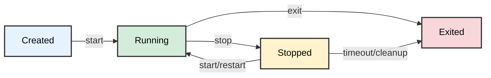

# RustBox

> A Docker-like container runtime written in Rust with daemon architecture, supporting multi-container orchestration, persistent state management, and comprehensive CLI commands.

## Overview

**RustBox** is a container runtime that isn't competing with Docker or Kubernetes. We return to the core and build a simplest "Sandbox/isolated runtime environment" from the lowest level Linux kernel mechanisms (namespaces, cgroups, OverlayFS, etc.), provides Docker-like functionality using:

- **Daemon Architecture** with Unix domain socket communication
- **Multi-container Management** with persistent state
- **Container Restart Support** with preserved filesystem state
- **OverlayFS** for isolated container filesystems  
- **Cgroups v2** for resource limits (memory, CPU)
- **Linux namespaces** for complete process isolation
- **Comprehensive CLI** with run, start, stop, list, inspect, remove, logs, and attach commands

This tool is designed for container orchestration, testing environments, and secure code execution.

## Requirements

- Linux kernel 5.x or higher (with overlayfs and cgroups v2 support)
- Rust (1.70+ recommended) 
- Root privileges (for daemon operations, mounting, and namespace creation)

## Architecture

### Daemon-Client Model

```
┌──────────────────────────────────────────────────────────────────────────────┐
│                                RustBox Architecture                          │
└──────────────────────────────────────────────────────────────────────────────┘

[rustbox CLI]                                 [rustboxd Daemon]
     │                                               │
     │  Unix Socket                                  │
     │  /tmp/rustbox-daemon.sock                     │
     │                                               │
     │  IPC Protocol (JSON messages)                 │
     │  ───────────────────────────────────────────▶ │
     │  Commands:                                   │
     │   • run                                      │
     │   • stop                                     │
     │   • list                                     │
     │   • inspect                                  │
     │   • remove                                   │
     │   • logs                                     │
     │   • attach                                   │
     │                                               ▼
     │                                    ┌────────────────────────────┐
     │                                    │  Container Manager         │
     │                                    │  ───────────────────────── │
     │                                    │  • Controls lifecycle      │
     │                                    │  • Creates sandbox env     │
     │                                    │  • Manages PTY + process   │
     │                                    └────────────────────────────┘
     │                                               │
     │                                               ▼
     │                                    ┌────────────────────────────┐
     │                                    │  Registry (HashMap<ID, Container>)│
     │                                    └────────────────────────────┘
     │                                               │
     │                     ┌────────────────────────────────────────────┐
     │                     │           Container Instances              │
     │                     └────────────────────────────────────────────┘
     │                         │              │              │
     │                         ▼              ▼              ▼
     │                    [Container 1]  [Container 2]  [Container N]
     │                         │              │              │
     │                  ┌──────────────────────────────────────────────┐
     │                  │              Sandbox Components               │
     │                  │  overlayfs + cgroups + namespaces             │
    - PTY Master: controlled by the daemon, mediates all I/O
    - PTY Slave : presented to the container process as its terminal
    - Unix Socket: transports attach stream between client ↔ daemon
    ───────────────────────────────────────────────────────────────

```

### Container Isolation

RustBox employs a **double fork** pattern for each container to ensure proper isolation:

### Process Hierarchy (Per Container)

```
[Daemon Process]
    └─> spawn_blocking()
        └─> [Container Task]
            └─> fork() #1
                ├─> [Namespaced Parent Process]
                │   ├─> unshare() - Creates new namespaces
                │   ├─> setup cgroups and overlay
                │   └─> fork() #2
                │       ├─> [Inner Child Process]
                │       │   ├─> Mount /proc and /dev
                │       │   ├─> chroot() to merged overlay
                │       │   ├─> chdir() to working directory
                │       │   └─> execv() - Execute command
                │       └─> [Namespaced Parent] waits for inner child
                │           └─> Unmounts /proc and /dev inside namespace
                └─> [Container Task] waits for namespaced parent
                    ├─> Unmounts overlay filesystem
                    ├─> Cleans up cgroups
                    └─> Updates container state in registry
```

### Container Lifecycle States



> Containers in the `Stopped` state can be restarted with the `start` command, preserving their filesystem state. Containers that have naturally exited (state `Exited`) cannot be restarted.

### Persistent State Management

- **Container metadata**: `/var/lib/rustbox/containers/<container-id>.json`
- **Container logs**: `/var/lib/rustbox/logs/<container-id>/`
- **Overlay filesystems**: `/var/lib/rustbox/overlay/<container-id>/`
- **State recovery**: Daemon recovers container state on restart

## Installation

### Build from Source

```bash
git clone https://github.com/isdaniel/RustBox.git
cd RustBox

# Initialize and update submodules (required for rootfs)
git submodule update --init --recursive

cargo build --release
```

**Alternative - Clone with submodules in one step:**
```bash
git clone --recurse-submodules https://github.com/isdaniel/RustBox.git
cd RustBox
cargo build --release
```

> This project uses git submodules to manage the container rootfs. The `rootfs/lowerdir` directory is a submodule pointing to a separate repository.

#### Initial Setup

If you've already cloned the repository without submodules:

```bash
# Initialize and clone the submodule
git submodule update --init --recursive
```

### Binaries

After building, you'll have two binaries:
- `rustbox` - Client CLI tool
- `daemon_rs` - Background daemon process

## Usage

### Start the Daemon

```bash
# Start the daemon in background (requires root)
sudo ./target/release/daemon_rs 2>&1 &
```

The daemon will:
- Listen on Unix socket `/tmp/rustbox-daemon.sock`
- Create system directories under `/var/lib/rustbox/`
- Recover existing container state from disk
- Handle graceful shutdown on SIGTERM/SIGINT

### Container Management

#### Create and Run Containers

```bash
# Run a container in background with TTY support (allows interactive attach)
sudo ./target/release/rustbox run --tty --memory 256M --cpu 0.5 /bin/bash

# Run a container with custom name
sudo ./target/release/rustbox run --tty --memory 256M --cpu 0.5 /bin/bash 2>&1

# Run a non-interactive container
sudo ./target/release/rustbox run --memory 256M /usr/bin/python3 script.py

# Run a container with user namespace isolation
sudo ./target/release/rustbox run --tty --isolate-user /bin/bash

# Run a container with network namespace isolation
sudo ./target/release/rustbox run --tty --isolate-network /bin/bash

# Run a container with both user and network isolation
sudo ./target/release/rustbox run --tty --isolate-user --isolate-network /bin/bash

# Stop a running container
sudo ./target/release/rustbox stop <container-id>

# Start a stopped container (preserves filesystem state)
sudo ./target/release/rustbox start <container-id>
```

> The `--tty` flag is required if you want to attach to the container later.

#### List Containers

```bash
# List running containers
sudo ./target/release/rustbox list

# List all containers 
sudo ./target/release/rustbox list -a
# or
sudo ./target/release/rustbox list --all
```

#### Attach to Running Containers

```bash
# Attach to a running container (container must have been created with --tty flag)
sudo ./target/release/rustbox attach <container-id>

# Example:
sudo ./target/release/rustbox attach f1a5f84880a1
```

**Interactive Controls**:
- Press `Ctrl+P` followed by `Ctrl+Q` to detach from container (leaves it running)
- Press `Ctrl+C` to send interrupt signal and exit

**Requirements**:
- Container must have been started with `--tty` flag
- Container must be in `Running` state

#### Inspect, Logs, and Remove Containers

```bash
# View container logs
sudo ./target/release/rustbox logs <container-id>
sudo ./target/release/rustbox logs --tail 50 <container-id>

# Inspect container details (shows current state, config, and timestamps)
sudo ./target/release/rustbox inspect <container-id>

# Remove a stopped or exited container
sudo ./target/release/rustbox remove <container-id>

# Force remove a running container
sudo ./target/release/rustbox remove --force <container-id>
```

**Available Options**:
- `--name` - Custom container name (auto-generated if not provided)
- `--memory` - Memory limit (e.g., "256M", "1G", "512000")
- `--cpu` - CPU limit as fraction of one core (e.g., "0.5", "1.0")
- `--workdir` - Working directory inside container (default: "/")
- `--rootfs` - Path to rootfs directory (default: "./rootfs")
- `--tty` - Allocate a pseudo-TTY for interactive use (required for attach)
- `--isolate-user` - Enable user namespace isolation (CLONE_NEWUSER)
- `--isolate-network` - Enable network namespace isolation (CLONE_NEWNET)

## Directory Structure

### Runtime Directories (created by daemon)

```
/var/lib/rustbox/
├── containers/           # Container metadata (JSON files)
│   ├── a1b2c3d4e5f6.json
│   └── f6e5d4c3b2a1.json
├── logs/                 # Container logs
│   ├── a1b2c3d4e5f6/
│   │   ├── stdout.log
│   │   └── stderr.log
│   └── f6e5d4c3b2a1/
│       ├── stdout.log
│       └── stderr.log
└── overlay/              # Overlay filesystem layers
    ├── a1b2c3d4e5f6/
    │   ├── lowerdir/     # Read-only base layer
    │   ├── upperdir/     # Container changes
    │   ├── workdir/      # Overlay work directory
    │   └── merged/       # Final mounted filesystem
    └── f6e5d4c3b2a1/
        ├── lowerdir/
        ├── upperdir/
        ├── workdir/
        └── merged/
```

### Source Code Structure

```
src/
├── lib.rs                # Public API exports
├── main.rs               # Client CLI entry point
├── daemon/               # Daemon implementation
│   ├── main.rs          # Daemon entry point
│   ├── server.rs        # Unix socket server
│   ├── container_manager.rs # Container lifecycle management
│   └── signal_handler.rs # Graceful shutdown handling
├── ipc/                  # Inter-process communication
│   ├── protocol.rs      # Message types and framing
│   └── client.rs        # Client-side socket communication
├── container/            # Container abstractions
│   ├── mod.rs           # Container data structures
│   ├── config.rs        # Configuration and validation
│   ├── sandbox.rs       # Core isolation logic
│   ├── state_machine.rs # Container state transitions
│   └── id.rs            # ID generation and validation
├── storage/              # Persistent storage
│   ├── metadata.rs      # Container metadata management
│   └── logs.rs          # Log file management  
├── cli/                  # CLI command implementations
│   ├── run.rs           # Create and start containers
│   ├── start.rs         # Start stopped containers
│   ├── stop.rs          # Stop containers
│   ├── list.rs          # List containers
│   ├── inspect.rs       # Container details
│   ├── remove.rs        # Remove containers
│   ├── logs.rs          # View container logs
│   └── attach.rs        # Attach to containers
└── error.rs             # Error handling
```

## Technical Details

### IPC Protocol

Communication between client and daemon uses length-prefixed JSON messages over Unix domain sockets:

```
[4-byte length (u32, big-endian)][JSON payload]
```

Example:
```
0x0000001E  {"type":"ListRequest","all":true}
```

## Known Limitations

### Container Lifecycle
- Containers that have naturally exited (state `Exited`) cannot be restarted
  - Only containers manually stopped (state `Stopped`) support restart functionality
  - Use `run` to create a new container instance if restart is needed for exited containers

### Networking
- Network isolation (`--isolate-network`) provides complete isolation without NAT or bridge networking
- No port forwarding or network connectivity for isolated containers
- Consider using host network (default) for containers requiring network access

### User Namespaces
- User namespace isolation (`--isolate-user`) may require kernel configuration
- Some distributions require enabling `kernel.unprivileged_userns_clone`
- File permission mapping may behave differently with user namespace isolation

### Daemon Persistence
- PTY master file descriptors are not persisted across daemon restarts
- Attach functionality is lost if daemon is restarted while containers are running
- Container processes continue running but cannot be attached until stopped and restarted

### Resource Management
- Cgroups v2 required (kernel 5.x or higher)
- Memory and CPU limits enforced but not strictly guaranteed under all conditions
- Swap limits depend on kernel configuration
